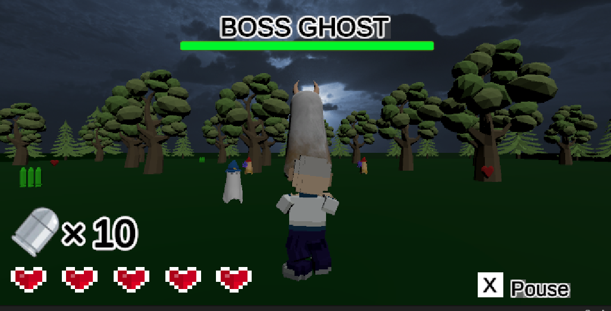
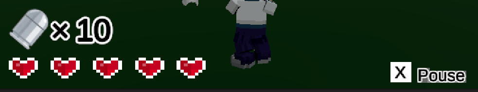

# GhostBreaker
 
# DEMO

The goal of the game is to use a gun to kill big ghosts.

This photo is an actual game screen. If you run out of hearts, the game is over.
 
# Features

 
"GhostBreaker" focuses on UI/UX to create a sense of immersion.
We designed the displays, sound effects, and information to be intuitively understandable.
 
# Requirement
 
* All files including "Ghostbreaker.exe"
 
# Installation

1.Click <>[code] in the file list.

2.Click Download Zip

3.Unzip the zip file anywhere

4.Double Click "GhostBreaker.exe"
 
# Note
 
Since the development version is 2022.3.24, it may not work with the latest version.
 
# Author
 
* Yuki Hotta
* kenkyujiro0229@outlook.jp
 
# License
 
"GhostBreaker" is under [MIT license](https://en.wikipedia.org/wiki/MIT_License).
